# 微信机器人项目

这是一个简单的微信机器人项目，拥有发送、接收消息的功能，其中机器人消息的发送是基于 `wechat-bot` 实现的。

## 功能列表

详细配置请看各模块目录下 `README.md`

| 标题 | 简介 | 用法 | 默认状态<br/>🚫✅ | 文件目录 |
| ---  | ---- | --- | --- | ------- | 
| ai_chat | 多种实现，多种渠道的 ai 对话机器人，包含百度文心一言、chatgpt | ai 传递给 ai 的内容 | 🚫 | `modules/ai_chat` |
| dingdong | dingdong bot，给机器人发 ding，机器人返回 dong | 仅管理员可用。 | ✅ | `modules/dingdong` |
| homeassistant | homeassistant 服务，调用本地的某些服务 | 请参考模块内容进行重写 | 🚫 | `modules/homeassistant` |
| jenkins | jenkins 自动构建服务，可以通过发送聊天触发构建项目 | jenkins构建 项目名称 | 🚫 | `modules/jenkins` |
| newspaper | 通过调用服务获取每日新闻 | 新闻 | 🚫 | `modules/newspaper` |
| stable_diffusion | 通过调用本地部署的 stable_diffusion 进行 ai 绘图，依赖另一个图片转发的项目 | AI画图 正向标签\\n逆向标签 | 🚫 | `modules/stable_diffusion` |
| weather | 通过调用魅族的天气服务获取天气信息 | 天气 | 🚫 | `modules/weather` |
| watchdog | 看门狗机器人，可以定义监听群消息规则，并转发给指定目标 | 监听指定消息 | ✅ | `modules/watchdog` |

## Useage

### docker 启动

请使用 `docker-compose.yaml` 启动。
```bash
docker compose up -d
```

## 项目树结构

```bash
src
├─ alapi
├─ app.ts                  # 入口类
├─ caffeine
├─ entity                  # 数据库实体
├─ mqtt                    # 系统 mqtt 操作
├─ system                  # 系统相关指令，以及数据库操作
├─ config.ts
├─ modules                 # 各种模块
│    ├─ ai_chat            # 大语言模型模块
│    ├─ dingdong           # dingdong 机器人，发 ding 回 dong
│    ├─ fishtouch          # 摸鱼机器人，发摸鱼回复摸鱼
│    ├─ homeassistant      # homeassistant 机器人，调用 ha 机器人
│    ├─ jenkins            # jenkins 机器人，发送消息触发 jenkins 构建
│    ├─ load_modules.ts
│    ├─ newspaper          # 新闻机器人，播报每日新闻
│    ├─ stable_diffusion   # ai 画图机器人，透传指令给 stable_diffusion
│    ├─ template           # 模块模板，若要添加模块请复制该目录
│    │    ├─ config.ts     ## 配置设计
│    │    ├─ disabled.ts   ## 如果目录下有该文件，代表该模块不会被加载
│    │    ├─ request.ts    ## 调用API设计
│    │    └─ service.ts    ## 服务本体设计
│    ├─ watchdog           # 看门狗机器人，将订阅群内指定消息并转发到别处
│    └─ weather            # 天气播报功能，播报每日天气
├─ utils
└─ wechat                  # 微信基础实现
```

## 功能添加/剪裁

可以通过拷贝 src/modules/template 并修改逻辑添加功能

可以删除 modules 下任意模块删除。

# 常见问题
1. 为什么一个消息会回复4次
   1. 原因是启动了多个模块，请尝试仅保持一个连接

## 流程

### 当前流程



## MQTT topic

| 名称 | 备注 | topic |
| --- | --- | --- |
| 发送单聊消息 |  | wechat/{登录的WXID}/send/user/{目标用户WXID} |
| 发送群聊消息 |  | wechat/{登录的WXID}/send/group/{目标群的WXID} |
| 模块加载启动消息 |  | wechat/services/{模块的Code} |
| 接收公众号消息 |  | wechat/{登录的WXID}/receve/subscriptions/{公众号WXID} |
| 接收到群聊消息 |  | wechat/{登录的WXID}/receve/groups/{群组ID}/users/{发送人ID}/{是否为@我} |
| 接收到单聊消息 |  | wechat/{登录的WXID}/receve/users/{发送人ID} |
| 发送系统调用 |  | wechat/{登录的WXID}/send/sys |
| 接收系统调用回复 |  | wechat/{登录的WXID}/receve/sys |

# TODOS
- [x] 更改服务导入方式，改为导入 service 类并通过代码初始化
- [ ] 为必要的db 操作加入缓存操作。


# 问题

多条消息会丢失