# 微信机器人项目

这是一个简单的微信机器人项目，拥有发送、接收消息的功能，其中机器人消息的发送是基于 `wechat-bot` 实现的。

## 功能列表

- 查询天气（济南）
- 摸鱼
- 晨报
- 报菜名

## 项目树结构

```bash
src
├─ alapi
├─ app.ts                  # 入口类
├─ caffeine
├─ config.ts
├─ modules                 # 各种模块
│    ├─ chat_glm_6b        # glm 模块
│    ├─ chat_gpt_api       # gpt 模块
│    ├─ dingdong           # dingdong 机器人，发 ding 回 dong
│    ├─ fishtouch          # 摸鱼机器人，发摸鱼回复摸鱼
│    ├─ homeassistant      # homeassistant 机器人，调用 ha 机器人
│    ├─ jenkins            # jenkins 机器人，发送消息触发 jenkins 构建
│    ├─ load_modules.ts
│    ├─ newspaper          # 新闻机器人，播报每日新闻
│    ├─ stable_diffusion   # ai 画图机器人，透传指令给 stable_diffusion
│    ├─ template           # 模块模板，若要添加模块请复制该目录
│    │    ├─ config.ts     ## 配置设计
│    │    ├─ disabled.ts   ## 如果目录下有该文件，代表该模块不会被加载
│    │    ├─ request.ts    ## 调用API设计
│    │    └─ service.ts    ## 服务本体设计
│    └─ weather            # 天气播报功能，播报每日天气
├─ utils
└─ wechat                  # 微信基础实现
```

## 功能添加/剪裁

可以通过拷贝 src/modules/template 并修改逻辑添加功能

可以删除 modules 下任意模块删除。

# 常见问题
1. 为什么一个消息会回复4次
   1. 原因是启动了多个模块，请尝试仅保持一个连接

## 流程设计

### 当前流程



## 设计

### 功能点设计

一个功能可能有多个功能点，功能点为树形结构。